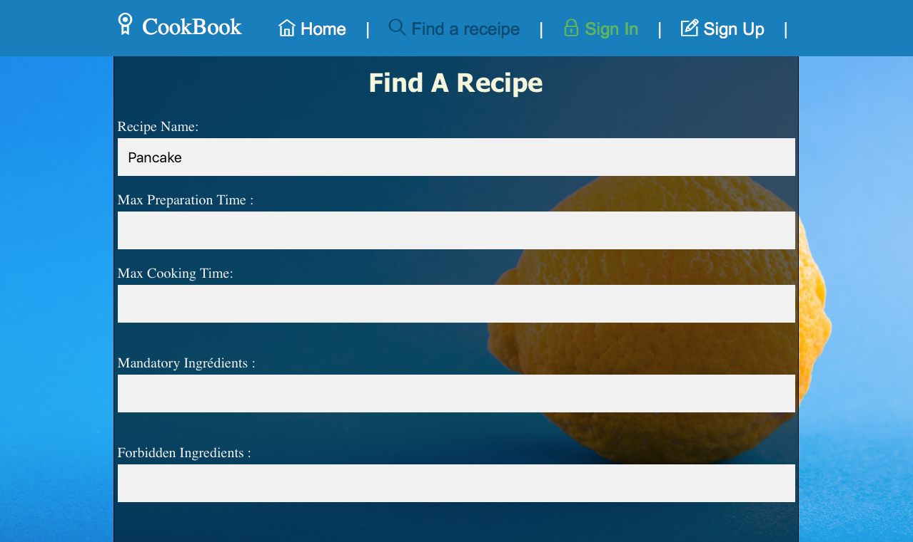
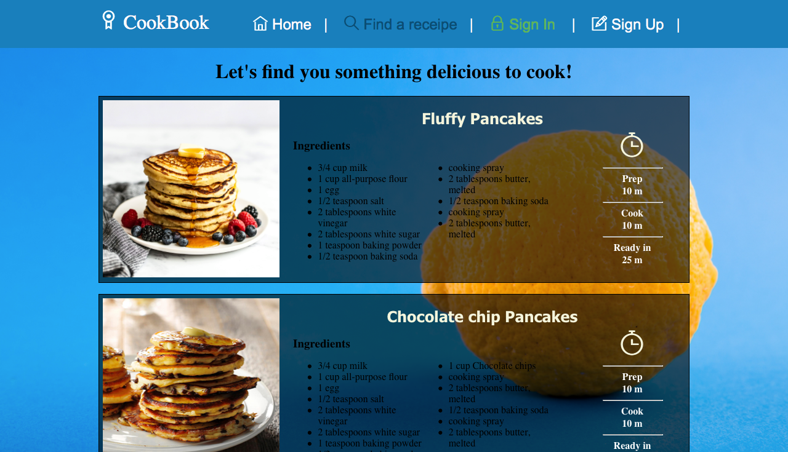
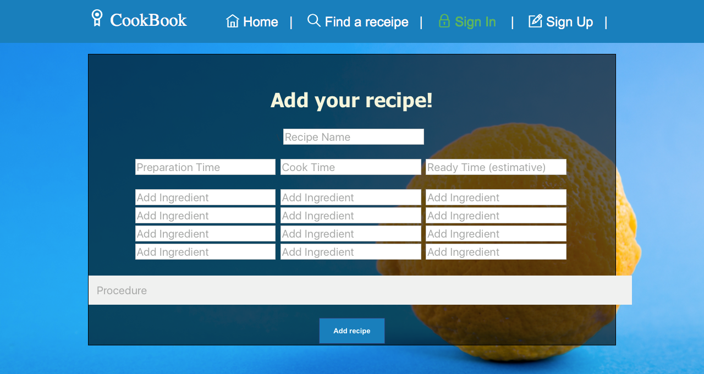
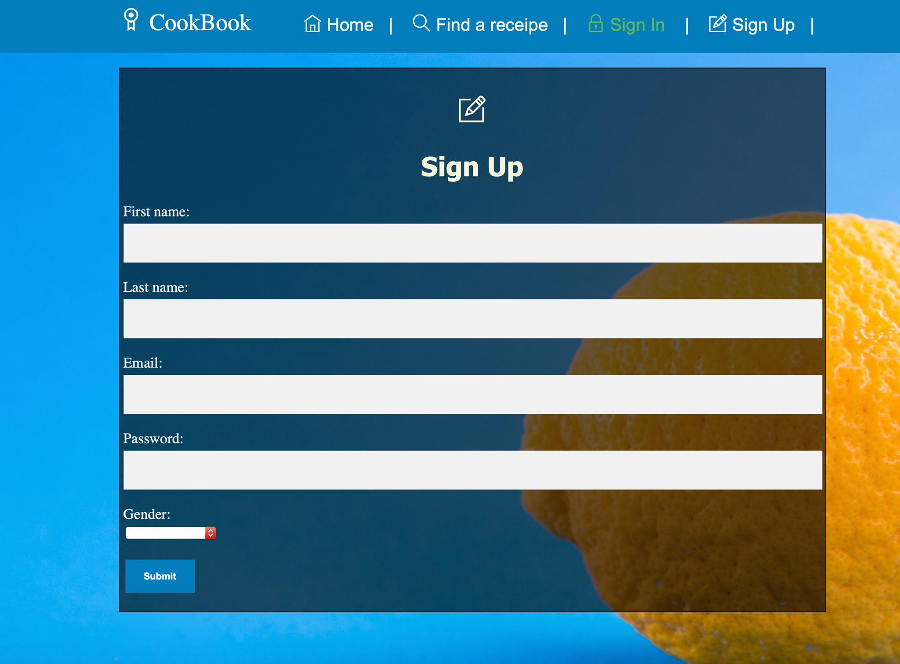
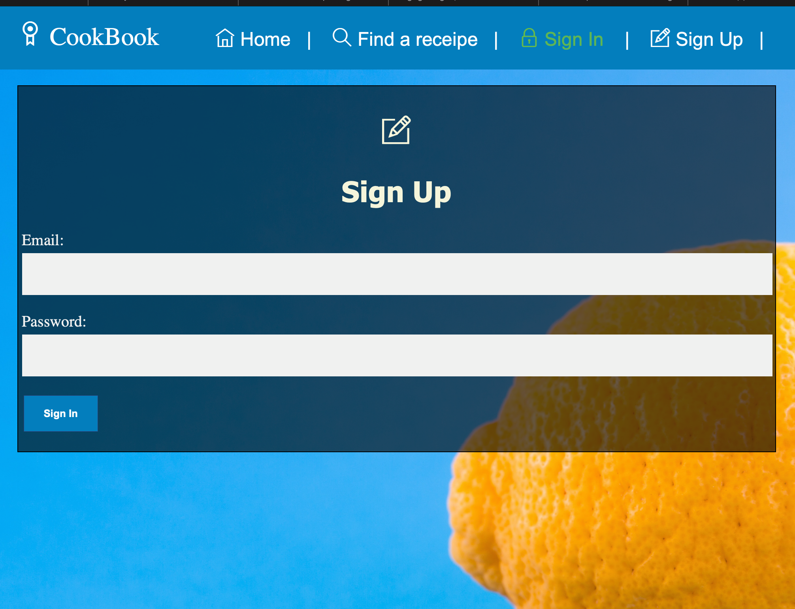

# CookBook

> A Vue.js project making use of Firebase's Firestore DB, and the firestorePlugin from Vuefire

## Team members :

| **Member Name**           | **Student ID** | **Email(s)**                  |
| :------------------------ | :------------- | :-----------------------------|
| Axel El Bakhti            | 8890998        | aelba103@uottawa.ca           |
| Anushka Paliwal           | 8269429        | apali035@uottawa.ca           |
| Simone Delisser           | 8753903        | sdeli009@uottawa.ca           |

## Project description :

We will be creating a recipe website where an user can create an account. 
They will be able to add their own recipes to their "cookbook" and pictures.
They will also be able to save recipes from other users on the site to their "cookbook".

## Colour Scheme :

I think we could use these colours for the website based off of arriva denmark
- 004d73 - a dark blue
- 00334e - a navy blue 
- 007fbd - a royal blue (currently using for buttons)
- dbebfa - a sky blue (currently the background color for all the pages)
Other colours that can be used
- 848a8c - a grey

## Features and views :
- Home Page 
    - generic welcome to website page with description
    - login/create account button can go to new page
    - A slider with 3 random recipes (will be completely in d3 in the front-end part)
- Recipe page
    - image of food
    - ingredients
    - directions
    - link back to home page
    - link to "my account"
- Account Page 
    - new Recipe button
    - view my recipes button
    - back to home page
    - show account detials i guess
- Make/Sumbit Recipe Page
    - textboxes to input ingredients/image/directions
    - submit button
    - cancel/back to home button
    - after submitting a page/popup that has the option to "add another recipes" or "go to your recipes" button

## Installation Instructions

``` bash
# initial installation of vue
npm install -g @vue/cli
```

``` bash
# initial installation of vue router
npm install vue-router --save
```

``` bash
# initial installation of vuefire
npm install firebase vuefire
```

## Build Setup

``` bash
# install dependencies
npm install

# serve with hot reload at localhost:8080
npm run dev

# build for production with minification
npm run build
```

For detailed explanation on how things work, consult the [docs for vue-loader](http://vuejs.github.io/vue-loader).

### Deliverable 3 updates

For this deliverable we have integrated vue.js with firebase to develop the app. So far, we have successfully connected these components of our tech stack. We are able to read and write to our database set up through firebase. We are slowly working towards changing the UI to make it more efficient to use with vue. We will also be adding more features by the next deliverable. 

### Deliverable 4 updates

For this deliverable we tried to cleanup our code and tried to implement testing. We refined some of our existing features, for example, adding a new recipe, firebase authentication etc. We also worked on a search and filter feature. 

#### Find a recipe page searching for pancakes



#### Search Results for pancake search



#### Adding a recipe  page



#### Sign up page



#### Sign in page


